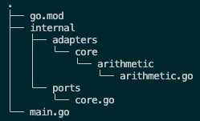

# How to struct your Go App - Hexagonal Architecture
How to apply hex architecture (ports & adapters) to a `grpc api` app in Go - video [link](https://www.youtube.com/watch?v=MpFog2kZsHk).

Other hex-arch & grps resources:
- DDD, Hexagonal, Onion, Clean, CQRS, How I put it all together [blog post](https://herbertograca.com/2017/11/16/explicit-architecture-01-ddd-hexagonal-onion-clean-cqrs-how-i-put-it-all-together/)
- Hexagon - a Kotlin microservices toolkit [page](https://hexagonkt.com/)
- [grpc.io]( )

# What is hexagonal architecture
[source](https://www.youtube.com/watch?v=MpFog2kZsHk)  


[source](https://hexagonkt.com/)  


## Layers
- `Domain` - core of application, contains domain/business logic
- `Application` - orchestrates the use of our domain code and adapts requests from the framework layer to the domain layer by sitting between the two
- `Framework` - provides the logic for outside components such as db or grpc adapters


**Dependency flow**
- The outside layers depends on the inside layers!  
- The Domain layer does not depend on the Application layer on anything, and the Application layer cannot depend on the Framework layer.

**Dependency injection**  
To communicate with the database from the Application layer we need to use dependency injection, ie:  
instead of calling framework to create an instance of db from the application layer, we invert the control of db instantiation to the program at startup, and have the program inject db instance into the Application layer.

## Project structure
<!-- TODO: add tree from terminal after all is coded -->


- `adapters` directory will contain the code for all our layers, each layer has its own subdirectory
    - `adapters/left` driving adapters
    - `adapters/right` driven adapters
- `ports` contain all ports organized by layer
- `main.go`
    - orchestrates the startup of the application,
    - contains code that connect all of the ports and adapters
    - contains code that injects dependencies into the layers that need them


# Stage 1 - Core layer


We defined:
- **arithmetic port**: `ArithmeticPort` in the core layer  
an interface for structs that implement basic arithmetic operations
- **arithmetic adapter**: `internal/adapters/core/arithmetic/Adapter` in the core layer  
that implements the interface

which completes core layer of our application.

# Stage 2 - Application layer


Here we will create port and adapter for the Application layer.
- `APIPort`: an application layer interface  
Here API means intermediary that allows two applications to communicate or interact with each other,  
it provides and interface for another application to interact with the application that defines the API.
- Application layer adapter: `internal/adapters/app/api/Adapter`  
    Application layer adapter will have `arith` field which contains core adapter.  
    This is how application layer will access the core of our application.  
    `ArithAdapter` will be provided to an `ApiAdapter` through dependency injection.
    

    ```go
    type Adapter struct {
        arith ports.ArithmeticPort
    }

    func NewAdapter(arith ports.ArithmeticPort) *Adapter {
        return &Adapter{arith: arith}
    }

    func (apiAdapter Adapter) GetAddition(a, b int32) (int32, error) {
        return apiAdapter.arith.Addition(a, b)
    }
    ```

# Stage 3 - Framework layer (driven adapters)


Added driven adapters:
- `DBPort` a driven port for db handling
- `internal/adapters/framework/right/db/Adapter` an implementation of `DBPort` using `mysql` driver
- an access for Application layer to the db, by adding a `DBAdapter` attribute to the `ApiAdapter`  
Similarly to `ArithAdapter` `DBAdapter` will be provided via dependency injection.

# Stage 4 - grpc (driving adapters)

## GRPC
- `RPC` - remote procedure call 
    - Allows for external computers to make calls that execute procedures in a different address space (or on another computer).  
    - These calls are coded as if it were a local procedure call without the programmer explicitly coding the details for the remote interaction.  
    - RPC allow to executer procedures on a remote computer as if you are executing local procedures from within your own program.
- `GRPC` uses `HTTP/2` (binary) protocol to send requests and receive responses.  
Being binary format `HTTP/2` makes transfer and parsing the data much more machine friendly than `HTTP/1` (which is textual) which makes it faster, more efficient and less error prone.
- `GRPC` uses also `Protocol Buffers` (`Protobuf`)
- `Protobuf`  
has two main components:
    - a method to serialize structured data (like `json` or `xml`) into binary format,
    - and a language to describe the structure of data and a program that generates source code from that description  
    The source code is used to write and read serialized data.
    The serialized data is a payload in `HTTP/2` used by `GRPC`


## Adapters


Added driving framework adapters:
- `server.go`
- `rpc.go`
- `proto/.go`